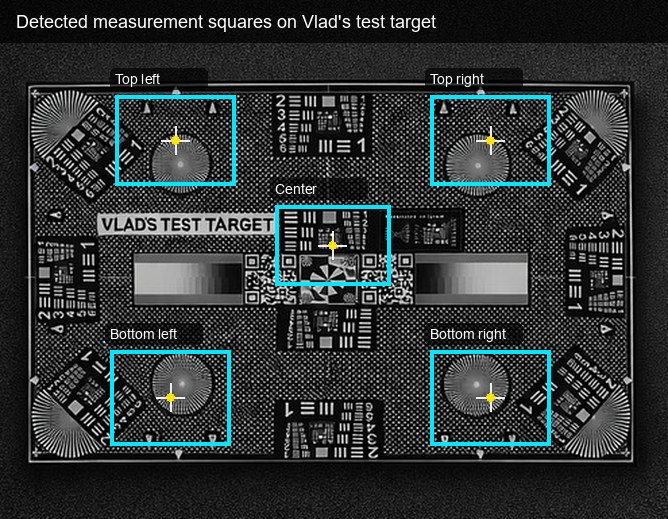
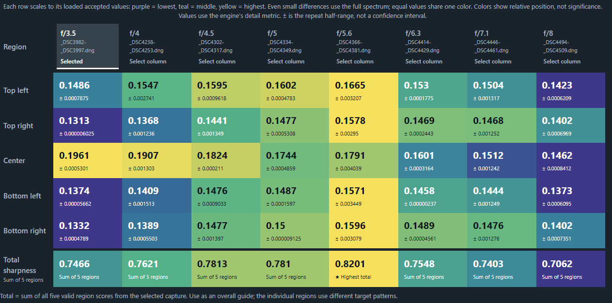

# Test Target Cropper (native C)

**New to TTC?** Read the [getting-started website](https://hsnilsson.github.io/ttc/)
for the capture recipe, aperture comparison walkthrough and safety guidance.
Try the [interactive online demo](https://hsnilsson.github.io/ttc/demo/) before
downloading: the real viewer with example target images and simulated processing.
Download the portable Windows x64 ZIP from [GitHub Releases](https://github.com/hsnilsson/ttc/releases/latest),
extract it completely, then launch `Launch TTC.vbs` (or `ttc.cmd serve`).
The executable and private runtime are included; processing stays on your computer.

TTC is a local tool for comparing lens sharpness and sensor/film flatness from
repeat photos of a printed test target. It finds or accepts five measurement
regions on Vlad's target, tracks those same regions through a stack of captures,
and turns the measurements into a sharpness map by aperture and image position.

This is useful because manual crop comparison is slow and easy to bias: each
aperture can have multiple repeats, corners can drift between frames, and one
bad capture should not quietly become the result. TTC keeps the source images
local, reuses the same target squares across the stack, reports rejected or
ambiguous regions explicitly, and exports an offline report that can be shared
without private file paths.



The app measures the center and four corner regions on the same target position
for every capture.



The report summarizes each aperture as a column and each measured target region
as a row, with a total row to make the best complete capture easier to spot.

Create a lossless PNG composite containing a center crop and four corner crops
for comparing lens sharpness and film/sensor flatness. Source pixels are copied
at 1:1 resolution; there is no resizing or JPEG recompression.

## Windows build

Run `build-simple.bat`, or from PowerShell:

```powershell
powershell -NoProfile -ExecutionPolicy Bypass -File .\build-windows.ps1
.\build\ttc-simple.exe 'D:\photos' -o .\output
```

The build script downloads checksum-pinned portable tools and source dependencies
into ignored `build/`, builds static libraries, and creates `build/ttc-simple.exe`.
It does not install system software or require `C:\libraw`. The first build needs
network access and disk space for the compiler. Subsequent builds reuse downloads.
The executable uses Windows system DLLs; no separately installed LibRaw or
libdeflate DLL is required. Keep the generated dependency license notices when
redistributing it. See [benchmark report](BENCHMARKS.md) for measured performance
and [test instructions](tests/README.md) for reproduction.

PNG encoding uses libdeflate with adaptive PNG filtering. This changes compression
bytes and file size, not decoded pixel values. A manual build without
`TTC_LIBDEFLATE` falls back to the original stb encoder.

## DNG rendering

DNGs go through LibRaw unpacking, processing and RGB bitmap export at full
resolution. Embedded previews and half-size decoding are never substituted.
Rendering uses daylight white balance, sRGB primaries, LibRaw's default gamma
curve/demosaic quality, fixed brightness, and metadata orientation. Automatic
white balance, automatic brightness and content-dependent white-level adjustment
are disabled so target brightness does not drive per-shot normalization.
Daylight WB may differ visibly from the camera's selected WB. Camera metadata
and calibration still affect rendering; this is RGB8 analysis output, not a
linear scientific RAW export or a color-managed reproduction workflow.

Earlier native code copied 16-bit RAW bytes as RGB8 without proper processing.
Its output was invalid and cannot serve as a color or performance reference.
The corrected output intentionally differs from that version.

Processing is sequential across files. A 244 MP DNG still requires several GB of
RAM during rendering. Decoded dimensions reflect LibRaw's active image and camera
orientation, not necessarily the entire sensor storage rectangle or DNG DefaultCrop.

## Usage

```powershell
.\build\ttc-simple.exe                 # Current directory
.\build\ttc-simple.exe 'D:\photos'     # Directory of PNG/JPG/DNG files
.\build\ttc-simple.exe . -o results    # Existing parent, create output directory
```

The output is a square canvas: center at the top, left/right corner pairs in
two rows below it, black padding in unused areas. The layout and crop coordinates
are unchanged by the performance work. Files are read from the selected directory,
not recursively. The legacy command-line scanner has narrower format support
than the underlying stb loader; use `.png`, `.jpg` or `.dng` inputs.

## Compare a stack with reusable ROIs

`ttc-simple --analyze target.roi new-results f4.dng f5.6.dng f8.dng` applies
named pixel-coordinate regions across a stack and produces an HTML report and
CSV with relative sharpness, contrast, clipping, and optional translation
tracking. See [ROI analysis usage and limitations](docs/roi-analysis.md).
These measurements are relative image-detail proxies, not calibrated lp/mm.

## Local browser comparison and offline sharing

The shared CLI/service in `local/ttc_local.py` imports aperture metadata, keeps
all repeats, supports editable five-region analysis, and selects one complete
capture per aperture with explicit manual overrides. It calls the same native
decoder and measurements as the CLI. The browser binds only to 127.0.0.1;
images stay local.

**Browse folders** opens a chooser inside TTC with drive shortcuts, parent-folder
navigation, and supported-image counts. Choose **Use this folder**, then **Open
folder** to import. You can also paste a folder path directly. Loading and path
errors appear in the app; no separate Windows dialog is required.

With Python 3.10+ and the native engine built:

```powershell
python local/ttc_local.py serve --engine build/ttc-simple.exe
python local/ttc_local.py analyze --input 'D:\photos' --roi target.roi --output new-comparison
```

The browser assets live in `web/`. The detector is enabled automatically by
the Windows build when `vlad_detector.h` is present. Manual ROI configuration
remains available. Aperture values can be corrected without decoding again;
changing ROIs invalidates previous measurements. Only one decode runs at once.

Share exports contain an offline HTML viewer, manifest, and full-detail aligned
ROI crops for all measured repeats. Private source paths and native logs are
excluded. Optional full-frame RGB8 export requires consistent integer shifts
across all five regions; unsupported frames are flagged and crop exports remain
available. Alignment does not correct rotation, scale, or subpixel motion.
Repeat half-range is a descriptive spread, not calibrated uncertainty.

See the [local API/result contract](docs/nightshift2-contract.md) and
[portable Windows distribution](docs/local-distribution.md). The portable
folder includes its own Python runtime; users do not need to install Python.

## License

TTC is MIT licensed; see [LICENSE](LICENSE). Dependencies retain their own
licenses. Build sources and generated binaries are excluded from Git.
