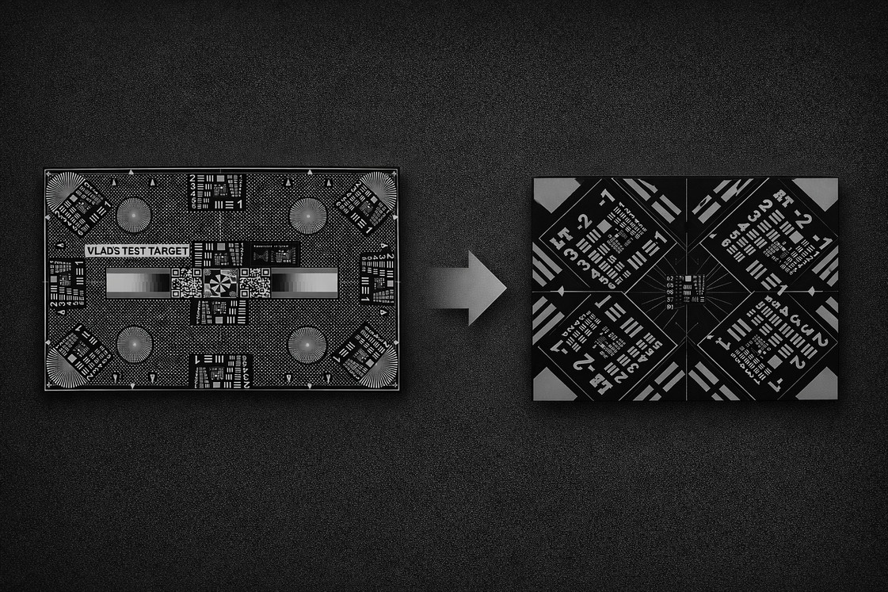

# Test Target Cropper (ttc)



Creates composite images from test target photos (DNG or PNG) for analyzing lens performance and optical setup quality. Extracts 4 corner crops and 1 center crop stitched together for easy scrutiny and sharing.

### Why use a test target like Vlads test targets?

- **Film flatness & optical quality:** Quickly assess how flat your film or sensor sits in the camera by comparing corner to center sharpness
- **Maximum resolution testing:** Measure the actual achievable resolution (lp/mm) of your complete setup—camera, lens, scanner, and film handling combined
- **F-stop optimization:** Easily compare multiple shots taken at different apertures side-by-side, making it simple to find the f-stop that gives your preferred balance of sharpness between corners and center

The tool dramatically reduces file sizes, making it faster to flip through sequences and much easier to share comparisons with others.

Just convert your test target photos to DNG first, then drop the executable in that directory and run it.

Consider everything below this paragraph as vibe coded and not too much checked. Happy cropping! And just create a github issue if there are any issues. /Henrik

## Installation

**Easiest (Windows):** Download `ttc.exe` from the [Releases](https://github.com/hsnilsson/ttc/releases) page. No dependencies required.

**From source (C implementation):**

**Windows:**

```cmd
# Option 1: Visual Studio Build Tools
build.bat

# Option 2: MinGW-w64
# Install MinGW-w64 and VIPS, then:
gcc -O2 -I"C:\vips\include" ttc.c -o ttc.exe -L"C:\vips\lib" -lvips -lglib-2.0
```

**Linux/macOS:**

```bash
chmod +x build.sh
./build.sh
```

**Manual build:**

```bash
git clone https://github.com/hsnilsson/ttc.git && cd ttc
make install-deps  # Install VIPS dependency
make              # Build ttc executable
./ttc --help
```

**Legacy Python version:**

```bash
git clone https://github.com/hsnilsson/ttc.git && cd ttc
pip install -r requirements.txt
python ttc.py --help
```

## Requirements

**C version:** VIPS image processing library

- Windows: Download from https://github.com/libvips/libvips/releases
- macOS: `brew install vips`
- Linux: `sudo apt-get install libvips-dev pkg-config`

**Python version (legacy):** Python 3.7+. Install deps: `pip install -r requirements.txt` (Pillow, rawpy, numpy).

## Usage

```bash
ttc                          # current directory → ./crops
ttc /path/to/photos           # custom input
ttc /path/to/photos -o out    # custom output dir
```

**DNG vs PNG:** By default ttc prefers **DNG** (processes only DNGs if present). If there are no DNGs but there are PNGs, it asks before using PNGs. To use only PNGs: `ttc --use-pngs` (or `--use-pngs-only`).

### Command line options

```
usage: ttc [-h] [-o OUTPUT] [--use-pngs-only] [-v] [input_dir]

Create composite images from Vlad's test target photos

positional arguments:
  input_dir             Directory containing PNG/DNG files (default: current directory)

optional arguments:
  -h, --help            show this help message and exit
  -o OUTPUT, --output OUTPUT
                        Output directory for composite images (default: INPUT_DIR/crops)
  --use-pngs-only, --use-pngs
                        Only process PNG files; default is to prefer DNG and fall back to PNG only after asking
  -v, --version         show program's version number and exit

Examples:
  ttc                    # Process current directory
  ttc ../test_photos     # Process parent directory
  ttc /path/to/photos    # Process absolute path
  ttc . -o results       # Custom output directory
```

## Configuration

Crop positions are percentage-based and set in `ttc.py`: `corner_positions` and `center_crop_percent`. Edit those to match your test target layout.

## Output

One composite per input file: `filename_composite.png` in the output directory (default `INPUT_DIR/crops/`). No compression; square corner crops; center overlay.

## License

MIT
